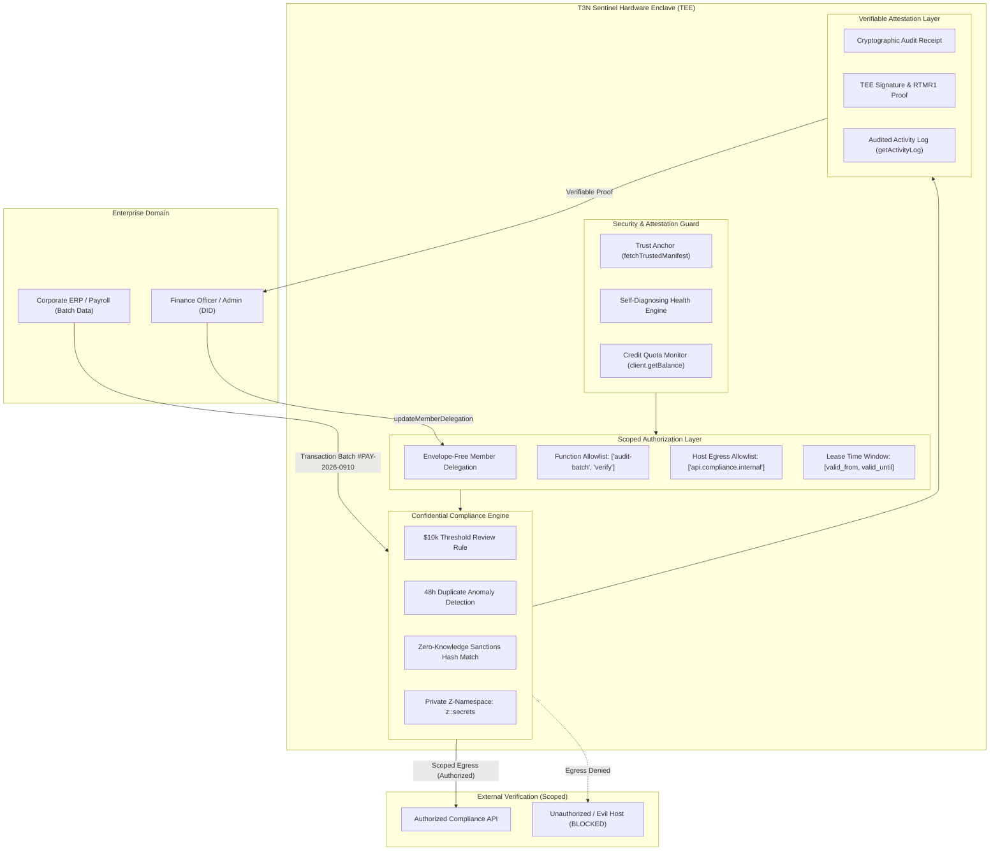

# T3N Sentinel: Architecture & Technical Specification

T3N Sentinel is a **Confidential Enterprise Audit & Control Agent** designed to run inside hardware-enforced Trusted Execution Environments (Intel TDX and AMD SEV-SNP) on the Terminal 3 Network (T3N).

---

## 1. Architectural Overview

---

## 2. Core Security Invariants

### 1. Hardware-Enforced Isolation
All memory buffers, financial amounts, employee IBAN hashes, and compliance rules are processed within the T3N enclave. Neither the host OS, cloud hypervisor, nor external observers can inspect in-flight data.

### 2. Envelope-Free Scoped Member Delegation
Access is governed by on-chain/enclave member delegation:
- **Function Allowlist**: Only designated WIT functions (e.g. `audit-payroll-batch`) can be executed.
- **Egress Host Allowlist**: Outbound HTTP calls via `http-with-placeholders` are restricted to hosts signed off by the data owner.
- **Temporal Boundaries**: Delegation leases are bounded by unix-second timestamps (`valid_from_secs`, `valid_until_secs`).

### 3. Credit Isolation & Metering Safety
Agent DIDs maintain isolated metering pools. The proactive `CreditMonitor` calculates run costs (4 credits per protected batch) and issues warnings before production exhaustion.

---

## 3. Cryptographic Verification Chain
- **Trust Anchor**: Client validates TDX quotes against direct-UEFI UKI boot measurements (`rtmr1_allowlist`).
- **Attestation Receipt**: Each batch generates a deterministic hash (`SHA-256(batchId : amount : count)`) paired with the TEE hardware measurement (`RTMR1`).
- **Activity Log**: Tamper-evident ledger commits allow compliance officers to verify every audit event via `client.getActivityLog()`.
